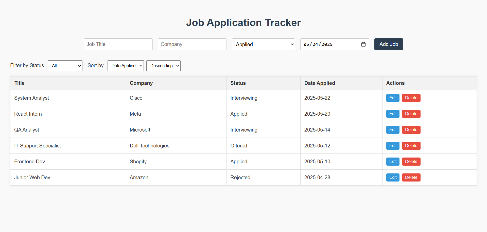
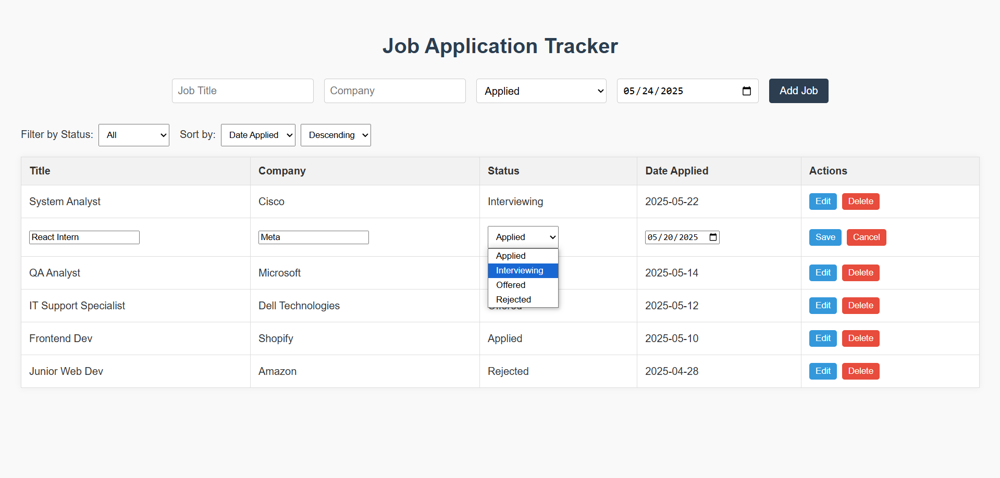

# Job Application Tracker

A simple, responsive React app to manage and track job applications.  
Built with beginner-friendly React patterns and deployed via Netlify.

## 🔧 Features

- ✅ Add new job applications (title, company, status)
- ✏️ Edit job entries inline
- 🗑️ Delete entries
- 🔍 Filter by application status
- 💾 Persists data in `localStorage`
- 📱 Clean UI styled with vanilla CSS

## 🚀 Live Demo

👉 [View live on Netlify](https://your-app-name.netlify.app)  
_(Replace this with your actual deployed link)_

## 🖼️ Screenshots

| Main View | Edit Mode |
|-----------|-----------|
|  |  |

> Save screenshots in a `screenshots/` folder in your repo

## 🛠️ Tech Stack

- React (Create React App)
- HTML/CSS
- JavaScript (ES6+)
- Netlify (deployment)

## 🗂️ File Structure

src/
├── App.js
├── JobForm.js
├── index.js
├── index.css

## 📦 Setup Instructions

## 📄 License

MIT — free to use, modify, and distribute.

```bash
git clone https://github.com/moeaoun1/job-application-tracker.git
cd job-application-tracker
npm install
npm start

